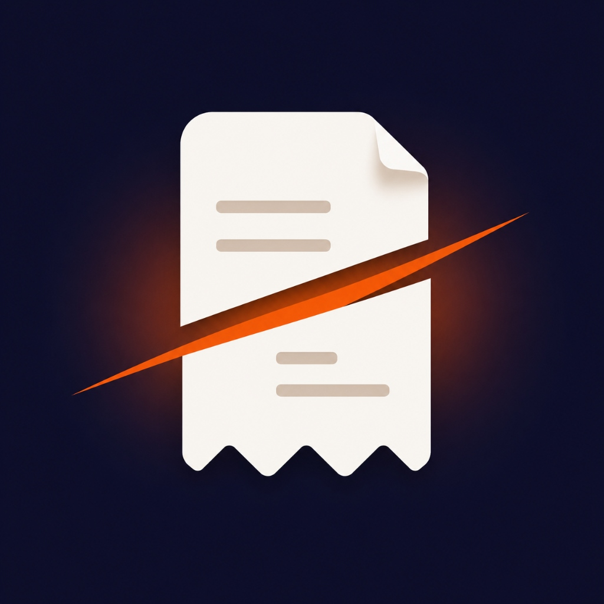
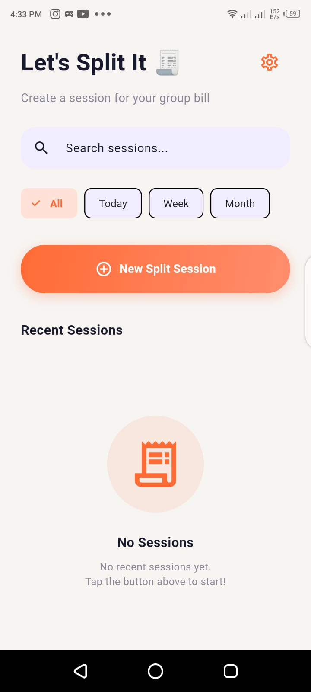
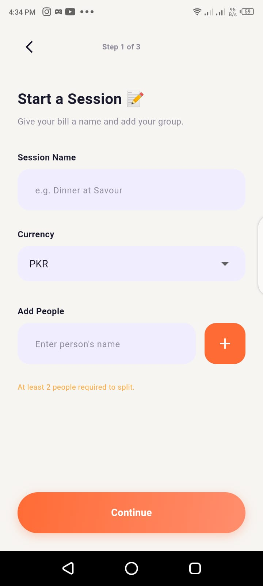
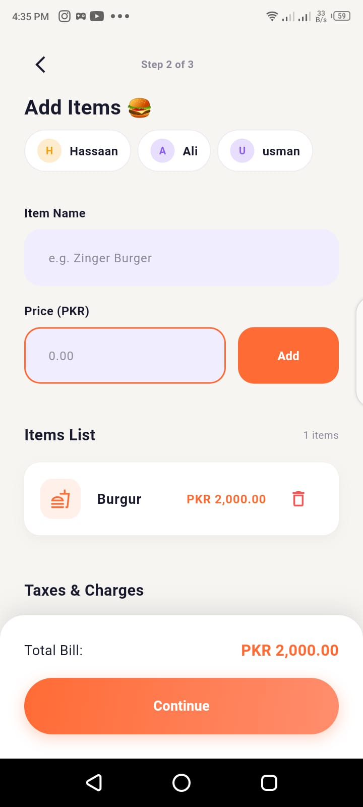
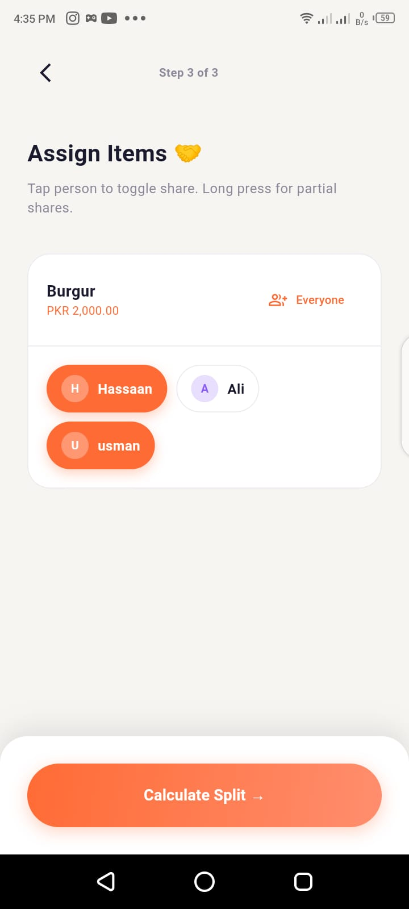
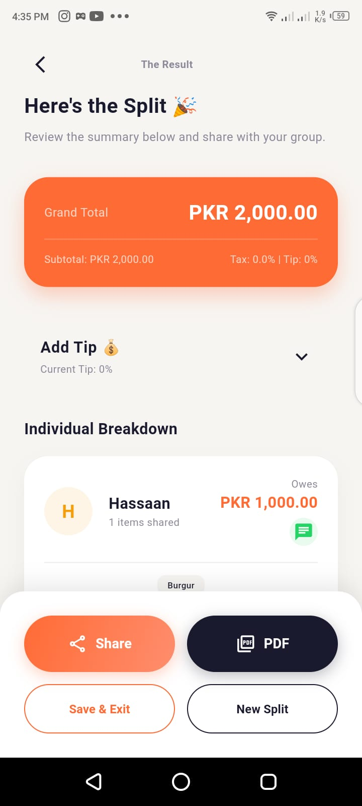
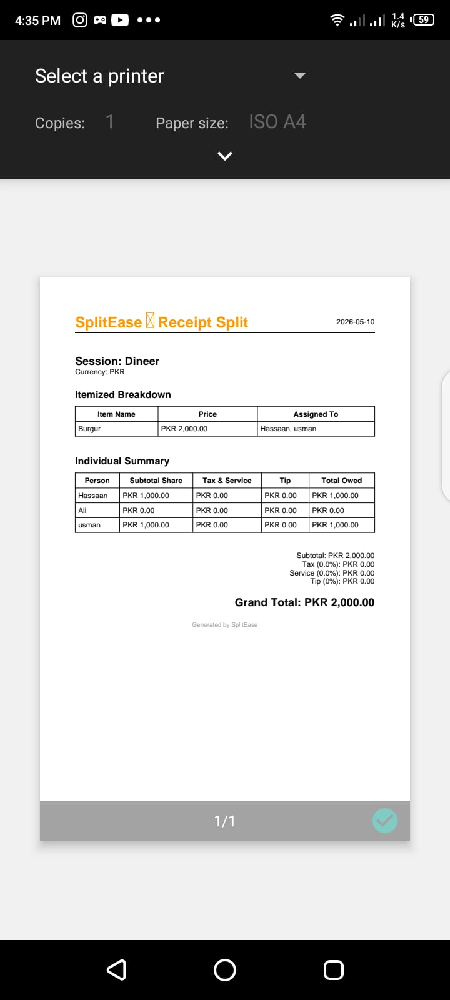

#  SplitEase - Effortless Bill Splitting

[](https://flutter.dev)
[](https://dart.dev)
[](https://opensource.org/licenses/MIT)

**SplitEase** is a modern, intuitive Flutter application designed to take the headache out of splitting bills and receipts. Whether you're dining out with friends, sharing household expenses, or managing group trips, SplitEase ensures everyone pays their fair share with minimal effort.

---

## ✨ Key Features

- 📸 **Receipt Scanning**: Capture bills directly using your camera (coming soon: AI-powered OCR).
- 👥 **Group Management**: Add friends and group members effortlessly.
- ⚖️ **Flexible Splitting**: Split by percentage, exact amounts, or equally.
- 📄 **PDF Export**: Generate professional PDF summaries of your shared expenses.
- 🔒 **Secure Access**: Protect your financial data with Biometric Authentication (Fingerprint/FaceID).
- 📤 **Easy Sharing**: Share split details instantly via WhatsApp, Email, or other platforms.
- 🌓 **Modern UI**: Beautifully designed interface with Google Fonts integration.

---

## 🛠️ Tech Stack

- **Framework:** [Flutter](https://flutter.dev)
- **Language:** [Dart](https://dart.dev)
- **State Management:** [Provider](https://pub.dev/packages/provider)
- **Local Storage:** [Shared Preferences](https://pub.dev/packages/shared_preferences)
- **Security:** [Local Auth](https://pub.dev/packages/local_auth)
- **Exporting:** [PDF](https://pub.dev/packages/pdf) & [Printing](https://pub.dev/packages/printing)

---

## 📸 Screenshots

| 🏠 Home Screen | ➕ Start Session | 🍔 Add Items |
| :---: | :---: | :---: |
|  |  |  |

| 🤝 Assign Items | 💰 Final Result | 📄 PDF Report |
| :---: | :---: | :---: |
|  |  |  |

---

## 🚀 Getting Started

### Prerequisites

- Flutter SDK: `^3.10.7`
- Dart SDK: `^3.0.0`
- Android Studio / VS Code

### Installation

1. **Clone the repository:**
   ```bash
   git clone https://github.com/hassaankhalid225/SplitEase-App.git
   ```

2. **Navigate to the project directory:**
   ```bash
   cd splitease
   ```

3. **Install dependencies:**
   ```bash
   flutter pub get
   ```

4. **Run the app:**
   ```bash
   flutter run
   ```

---

## 📂 Project Structure

```text
lib/
├── core/           # Constants, themes, and utility functions
├── models/         # Data models (Session, Member, Item)
├── providers/      # State management logic
├── screens/        # UI Screens (Home, Result, Create Session)
├── widgets/        # Reusable UI components
└── main.dart       # Entry point
```

---

## 🤝 Contributing

Contributions are what make the open-source community such an amazing place to learn, inspire, and create. Any contributions you make are **greatly appreciated**.

1. Fork the Project
2. Create your Feature Branch (`git checkout -b feature/AmazingFeature`)
3. Commit your Changes (`git commit -m 'Add some AmazingFeature'`)
4. Push to the Branch (`git push origin feature/AmazingFeature`)
5. Open a Pull Request

---

## 📜 License

Distributed under the MIT License. See `LICENSE` for more information.

---

## 📧 Contact

**Hassaan Khalid** - [GitHub](https://github.com/hassaankhalid225)  
Project Link: [https://github.com/hassaankhalid225/SplitEase-App](https://github.com/hassaankhalid225/SplitEase-App)

<p align="center">Made with ❤️ for easy splitting!</p>